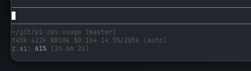

# Pi coding agent Z.ai Usage Extension

[](https://codecov.io/gh/shaftoe/pi-zai-usage)

A [Pi coding agent](https://pi.dev/) extension that monitors [Z.ai subscription](https://z.ai/subscribe) API token usage quota and automatically displays usage in the footer when using the Z.ai provider.



## Features

- **Auto Footer Display**: Automatically shows usage in the footer when using Z.ai models
- **Smart Caching**: Fetches usage every 30 seconds to avoid excessive API calls
- **Time Tracking**: Displays remaining time until quota reset

## Setup

### Prerequisites

- [Bun](https://bun.sh/) - Fast JavaScript package manager and runtime

### Installation

```bash
pi install npm:@alexanderfortin/pi-zai-usage
```

or

```
pi install https://github.com/shaftoe/pi-zai-usage
```

or if you prefer to build and keep it checked out locally:

```bash
git clone https://github.com/shaftoe/pi-zai-usage
cd pi-zai-usage

# Install dependencies
bun install

# Build the extension
bun run build

# Install the extension
pi install ./
```

## Development

This project uses modern TypeScript development tooling:

- **Bun** - Fast package manager and runtime
- **TypeScript 6** - Static type checking with strict mode enabled
- **Biome** - Ultra-fast linter and formatter

```bash
# Type check
bun run typecheck

# Lint code
bun run lint

# Auto-fix lint issues
bun run lint:fix

# Format code
bun run format

# Run all checks
bun run check

# Watch mode for development
bun run dev
```

## Usage

### Automatic Footer Display

When using a Z.ai model (e.g., `glm-4.7`, `glm-5`, `glm-5-flash`), the extension automatically displays the usage in the footer (between brackets the time left for the quota to be reset):

```
Z.ai: 45% (2h 15m 30s)
```

The footer updates after each AI turn and on model selection changes.

## Configuration

No configuration needed. The extension automatically:
- Uses cached data for 30 seconds to avoid excessive API calls
- Shows/updates status only when Z.ai models are active
- Clears status when switching to non-Z.ai models

## API

The extension uses the Z.ai API endpoint: `https://api.z.ai/api/monitor/usage/quota/limit`

Make sure you're logged in to Z.ai via Pi (`/login for Z.ai`).

## Releasing

This project uses automated publishing to NPM via GitHub Actions. The workflow will:
- Run all CI checks
- Build the package
- Publish to NPM with provenance (signed) via [trusted publishing](https://docs.npmjs.com/trusted-publishers)

## License

MIT
